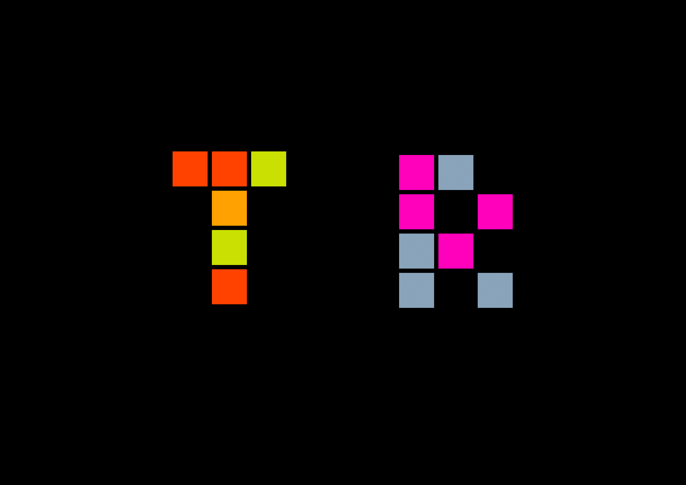

# this is what i did in week one.

We began the first lesson on a virtual walk in Minecraft Melbourne. I haven't played Minecraft since I was like eleven...

 

Here we were introduced to the idea of digital performance art and e-literature (which we will explore further later on). We started to learn the possibilities of our first brief. Our task is to explore how reading is changing in virtual environments, and in groups interpret text through a performance in an online gaming environment. This task will introduce us to communicating theories in reading and language in digital worlds which is pretty cool.

 

Andy showed us Joseph DeLappe's performance of an episode of Friends, where each player logged into the game as one the characters and recited their lines. The performers functioned as passive, neutral visitors to the game - killed and reincarnated to continue the performance. I checked out other gaming performances by him and thought they were sick.  

We were also introduced to Processing, and learnt how to code shapes, lines and colours. 
Our task for the week was to create our initials with the new skills we had learnt. I used isolated squares to form my letters, which allowed me to get used to x and y coordinates and I could also play around with changing the colour of each square by moving my mouse. 

Also played around with WEBGL. > [Click here to see](https://taylarogic.github.io/codeWords/01/T_R/) (you have to scroll down)

[WEEK 02](https://taylarogic.github.io/codeWords/02/)
