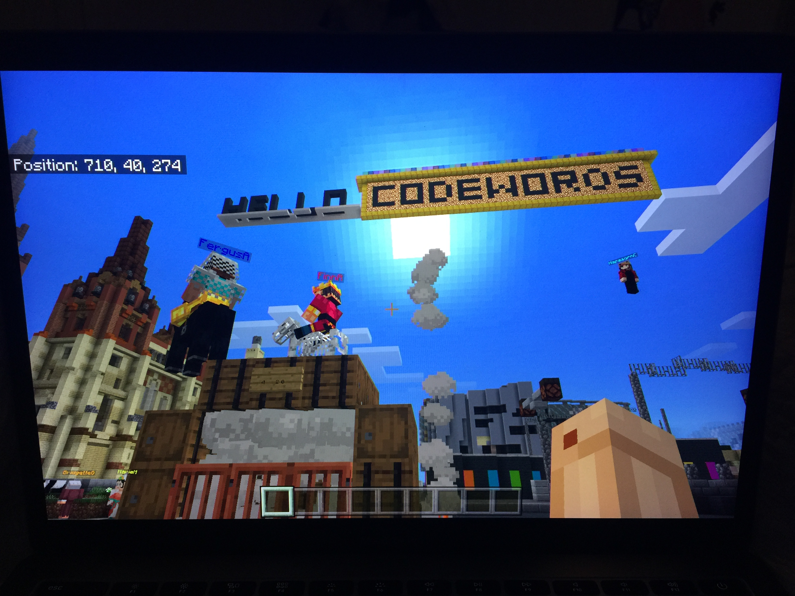
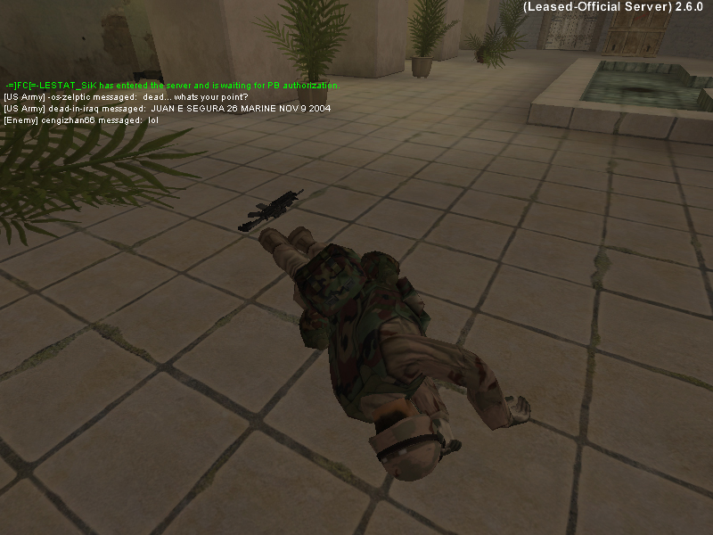
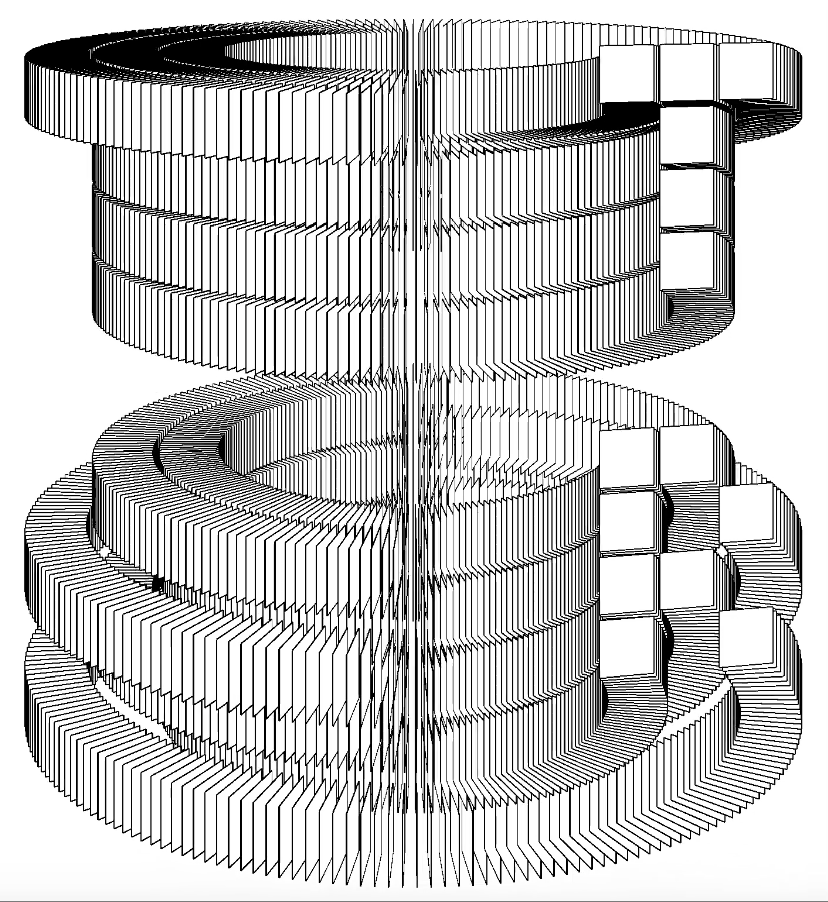

# this is what i did in week one.

We began the first lesson on a virtual walk in Minecraft Melbourne. 

 

Here we were introduced to the idea of digital performance art and e-literature (which we will explore further later on). We started to learn the possibilities of our first brief. 

 

We were also introduced to Processing, and how we could code shapes, lines and colours. 
Our task was to create our initials with these new skills we had learnt. 

