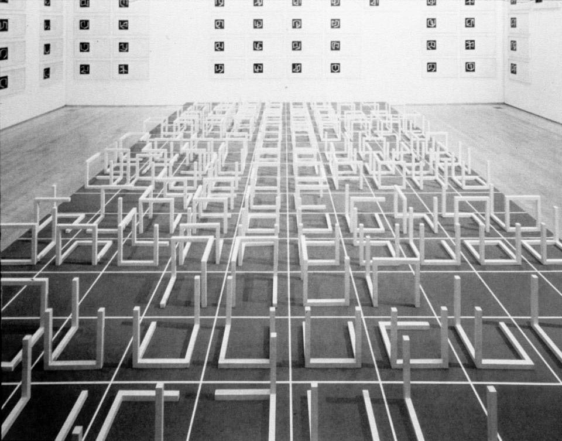
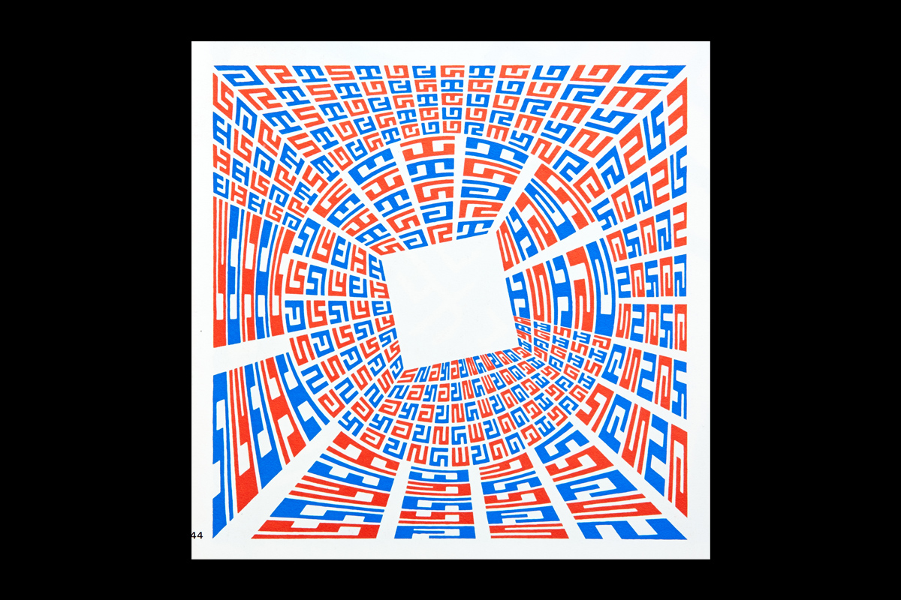
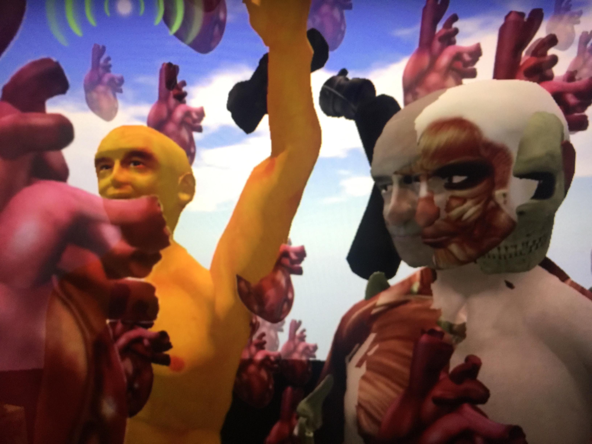
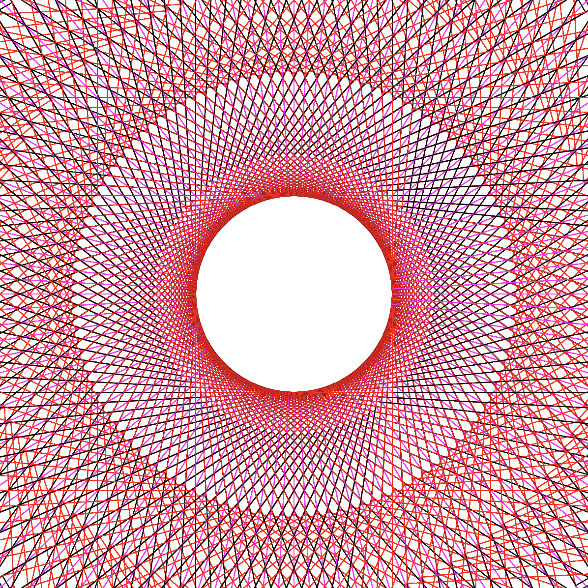

# this is what i did in week two. 

We discussed and researched modular typeface designs, from the Bauhuas to contemporary designers working in algorithmic typography. I personally enjoyed the work of Jurriaan Schrofer.

We also made further progress on our assignment where we were tasked with reinterpreting a portion of the novel House of Leaves by Mark Z. Danielewski, in a virtual gaming world. My group made the decision to reenact our passages in Second Life.

More learning on Processing was done, with experimentation with spirographs. We also were introduced to Github and created our first repository. 

