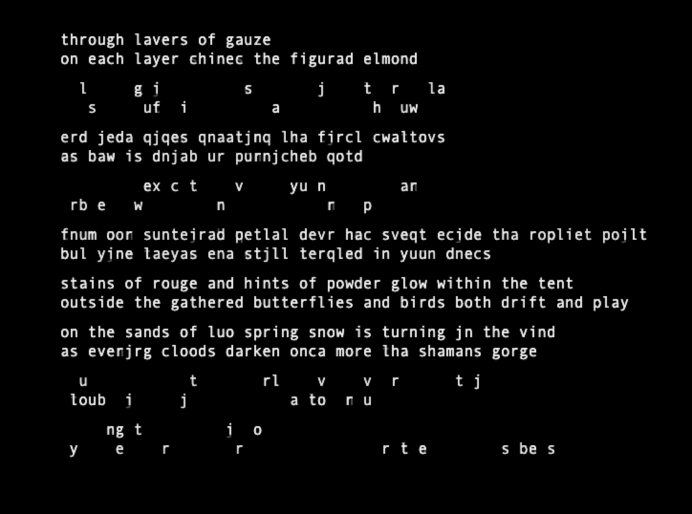

# this is what i did in week three.

This week we learnt and did research on electronic literature such as generative texts and novels such as AI Dungeon, a generative text software we joined to create a story. We shared examples of e-lit and I found John Cayley's work to be interesting, especially [Suflosi](http://programmatology.shadoof.net/ritajs/suflosijs/index.html), where a translated passage changes; surfacing, floating, sinking. This is something that I will keep in mind as possible inspiration for when we begin our major projects. [These are our examples of e-lit, very cool stuff](https://docs.google.com/presentation/d/1QXcxFkKdzMiwNWBSdXT0LG9YNFjlzViwScTtsLMXROo/edit#slide=id.g8e5317bdfc_0_33).

We began imagining, planning, building our chosen virtual worlds for our assignment for the remainder of the class. We were realising that Second Life allowed us to create an uneasy, although quirky, atmosphere present in the original text of House of Leaves. This excited us as we explored different environments in the game and found some weird, unholy stuff. My group would play together, exploring the possibilities of the game, trying to find locations to film, distorting our avatars shape/appearance and virtually nightclubbing at Big Daddy's Nightclub. Was pretty funny. We also read our passage a few times to help us know what kinds of destinations and objects we needed, as well as what avatar alterations should be made to best replicate our characters. 

[WEEK 02](https://taylarogic.github.io/codeWords/02/)~~~>[WEEK 04](https://taylarogic.github.io/codeWords/04/)
