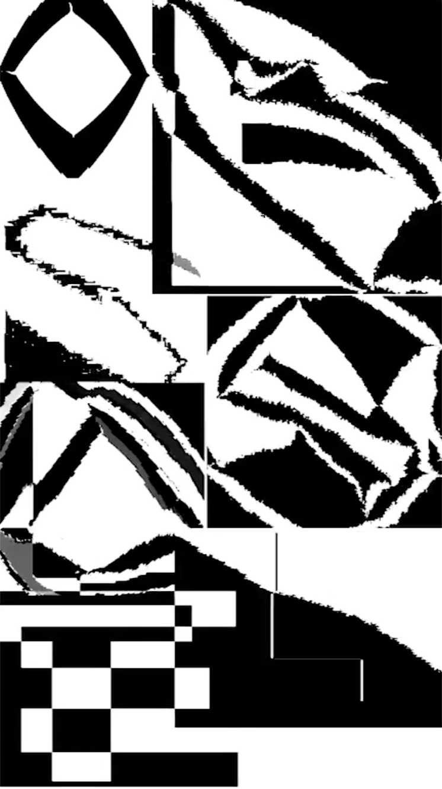
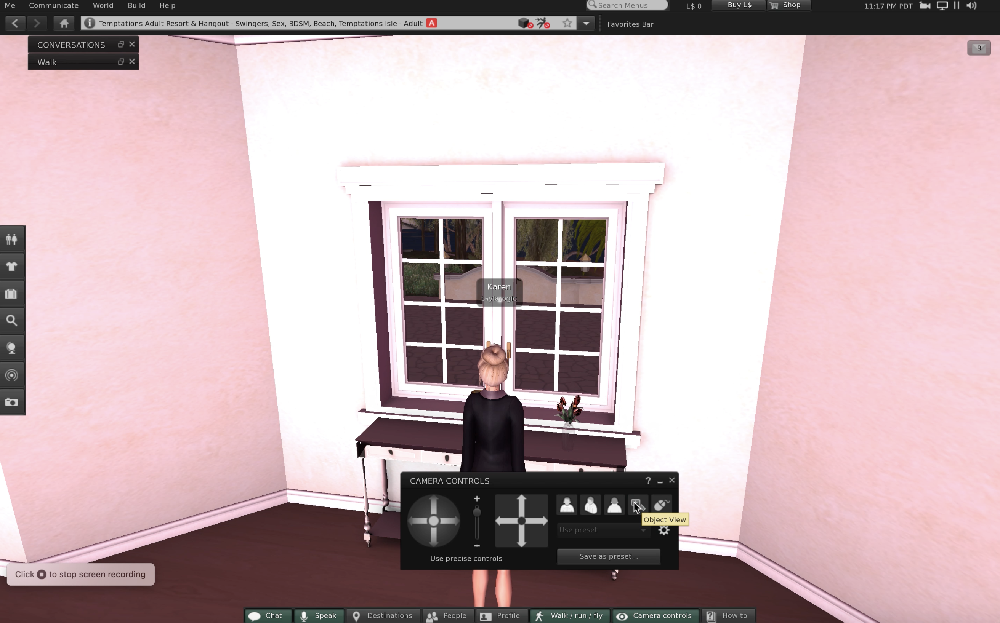

# this is what i did in week three.

This week we learnt and did research on electronic literature such as generative texts and novels such as AI Dungeon, a generative text software we joined to create a story.

We began imagining, planning, building our chosen virtual worlds for our assignment for the remainder of the class. We were realising that Second Life allowed us to create an uneasy, albeit quirky, atmosphere present in the original text of House of Leaves. My group would play together, exploring the possibilities of the game, trying to find locations to film, distorting our avatars shape/appearance and virtually nightclubbing. 

