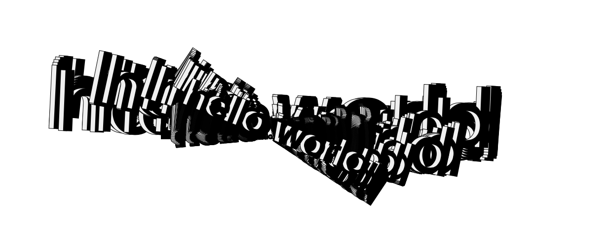
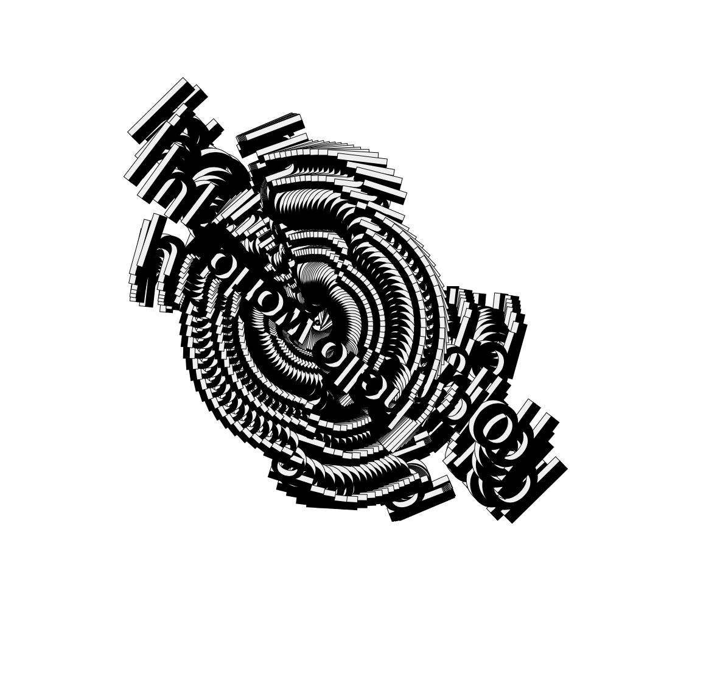

# this is what i did in week four.

Karen ann demonstrated how to introduce typography to our Javascript sketch. The functions we used were the preload() and the loadFont(), as well as type related functions to position words on the page.We also added movement (spinning) linked to mouse coordinates mouseX and mouseY.

We continued learning how to use Github to record our learning to form our SKO. 

My group began trialling filming for our Second Life project. Unhappy with the footage, we would continue location scouting, and better planning our scenes before we went to film again. Finding the right destinations became an interesting task as the four of us went location scouting for a house (surprisingly hard to find a house devoid of people, and with “ normal “ house things). This at times was difficult and laughable as we would get kicked out of destinations (some were private locations, some I think we were just being annoying for people talking with our mics on lol-thus we decided to talk in private calls instead). Another problem we experienced was the nudity plaguing every environment. We shot in a house and in almost every scene a naked man named David would walk in. 
