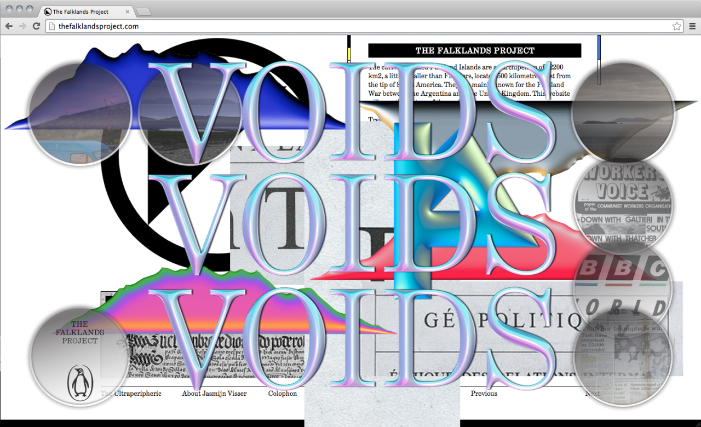
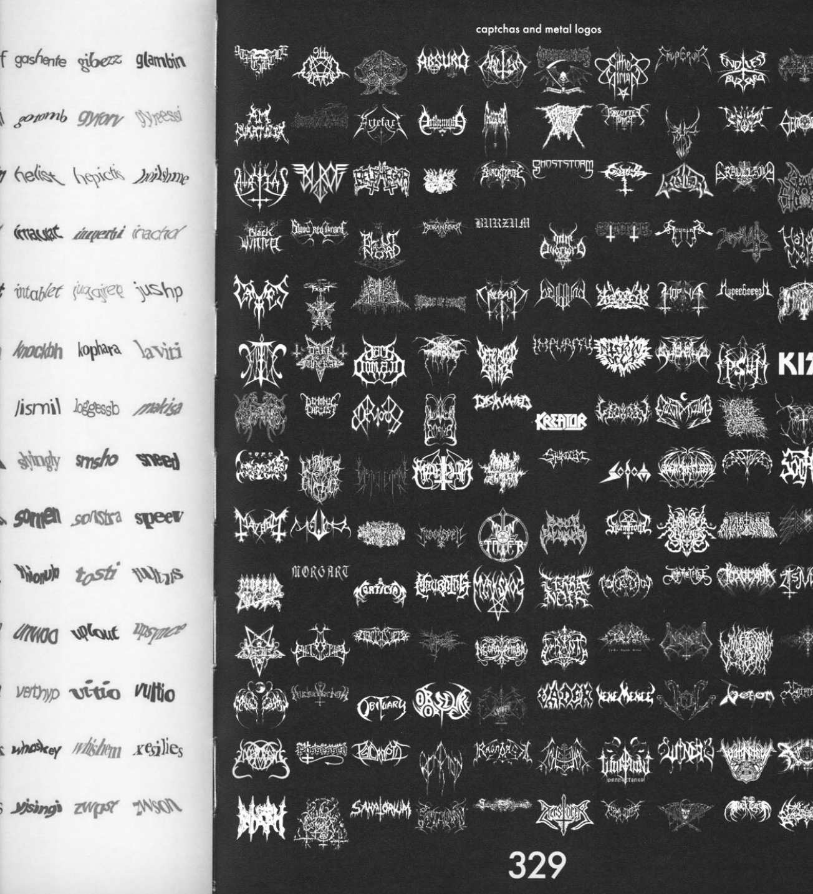
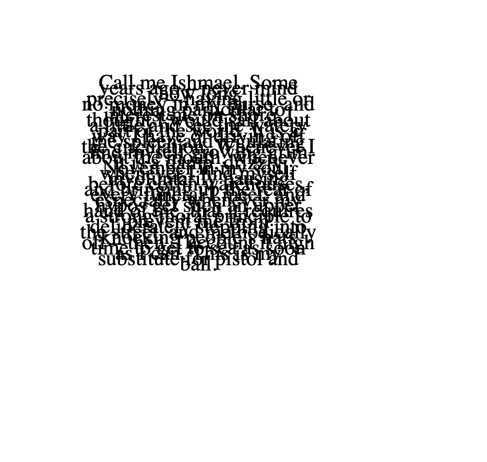

# this is what i did in week six.

This week we looked at paper prototypes and our next brief. For our major projects we are to research, develop, code and publish a digital version of a critical text. I chose Blackletter and Black Metal by [Metahaven](http://sprawl.space/) as my critical theory/text to base my assignment on as the concept of illegibility as code excited me. The encoding and encryption of the intricate, maze-like type, as opposed to clear communication is a narrative I'd like to translate in my project.

>[REally goddamn cool Metahavan work](https://theinfluencers.org/en/metahaven)

Key passages from the text that I will base my project on are:

>'The logo is a password-behind it, a secret world is waiting. Illegible logos and messages are an unprecedented brand of fantasy in the otherwise rationalised world of visual trademarks, especially when seen in public. Their coded, forbidding appearance negates common assumptions on how to properly visualise an organisation…Black metal logos are perhaps pseudo-religious or faux ideographic forms more akin to encoding and encryption than they are to clear (‘public’) communication.'

I like the password vs trademark commentary here.

>'The logo of an underground black metal band had to be illegible-asymmetrical maze of jagged forms. The brand message of the illegible logo, of which there are now many thousands, is the visual personification of an idea of ‘Evil’-and with that, a carefully fabricated stance of rejection of the ‘modern world.’

Here, black metal logos are described as an unconventional form of design, rebelling against what is considered well communicated design. The text also brings light to the subculture of metal bands and their fandoms; niche, cult-like and exclusive. This notion of exclusivity and inclusivity in design is also in relation to the password vs trademark example. 

>'Black metal’s illegible logos functionally correspond to the age of individualism; they are more structurally similar to the bar code and the CAPTCHA than to the swastika. Whereas the Third Reich’s symbols and propaganda tools were mass communication devices meant for entire populations, black metal logos- especially when combined with extreme rightist political views- have come to symbolise the hatred of more or less specifically named others by preventing the public from reading the symbol. While the political views endorsing the aesthetic may be considered regressive and backward, its sense of visual method is not. It bridges the publicly visible and widely accepted notion of the ‘trademark’ with the privately defined idea of the ‘password.’

Love this comparison to reCAPTCHA's. Will definitely be inspired to create something that communicates this in an uncommunicative way (as it wouldn't be very metal of me to make it clear and legible).

Karen ann also demonstrated how to code larger blocks of texts! Which will be very helpful for our major projects, yay!

[WEEK 05](https://taylarogic.github.io/codeWords/05/)~~~>[WEEK 07](https://taylarogic.github.io/codeWords/07/)
