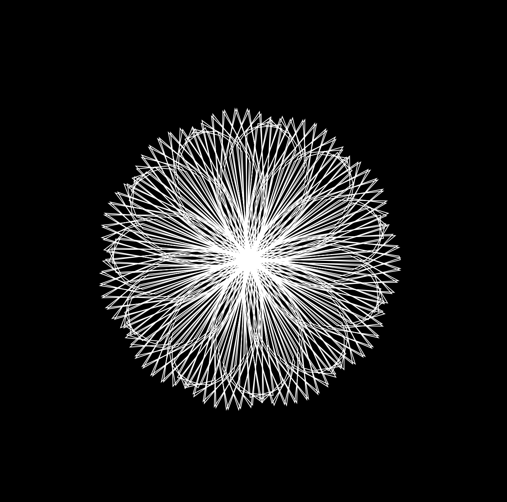
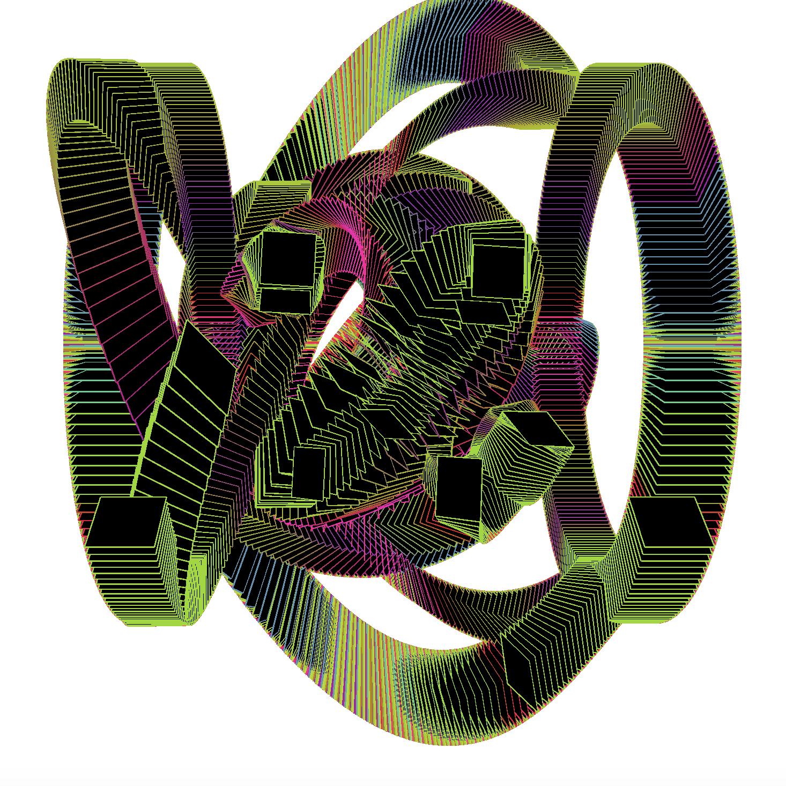
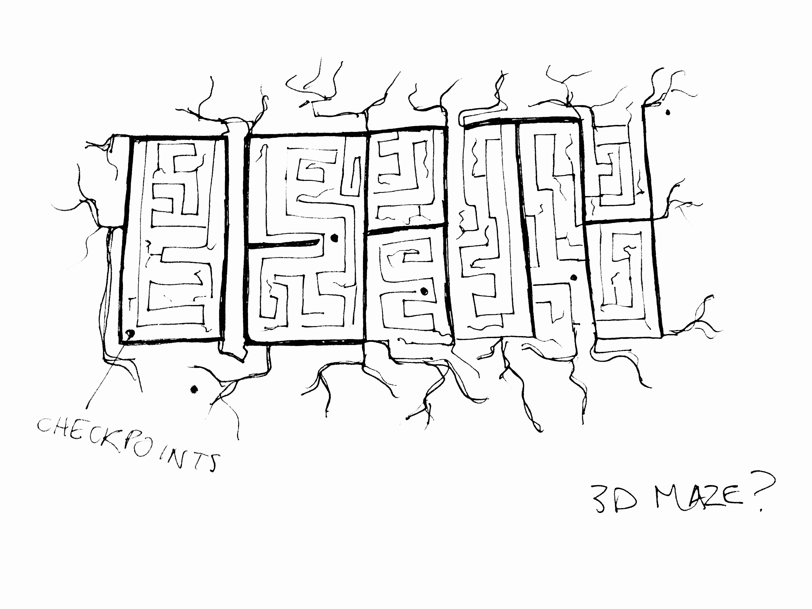

# this is what i did in week seven. 
Over the semester break I played around with coding [mathematical roses](https://www.youtube.com/watch?v=f5QBExMNB1I&ab_channel=TheCodingTrain) and also some other fun stuff. In this week I explored code as an inventive and exploratory practice, involving happy accidents and problem solving that can result in really interesting and surprising design outcomes such as expected and unexpected shapes, patterns, symmetry, asymmetry, repetition, tiling, etc. I have started using these experiments for other assignments outside of this class!

I also prototyped my project. With reference to the analogy of black metal logos resembling a maze, I decided to draw the word 'death' in a maze as the text mentions it would be essential for metal bands to feature that word. I am working on figuring out a way to make it interactive. I am not sure at the moment if I would want it to function like an actual maze or if this is just an non-functioning, aesthetic choice, and implement interactivity elsewhere. Would be possibly cool if I could get my sketch to grow some kind of lightning or branches, but I don't want my sketch to be super literal and look metal. I would rather keep messages about it being about black metal logos hidden so I can represent the text's ideas of ambiguity. 

[WEEK 06](https://taylarogic.github.io/codeWords/06/)~~~>[WEEK 08](https://taylarogic.github.io/codeWords/08/)
