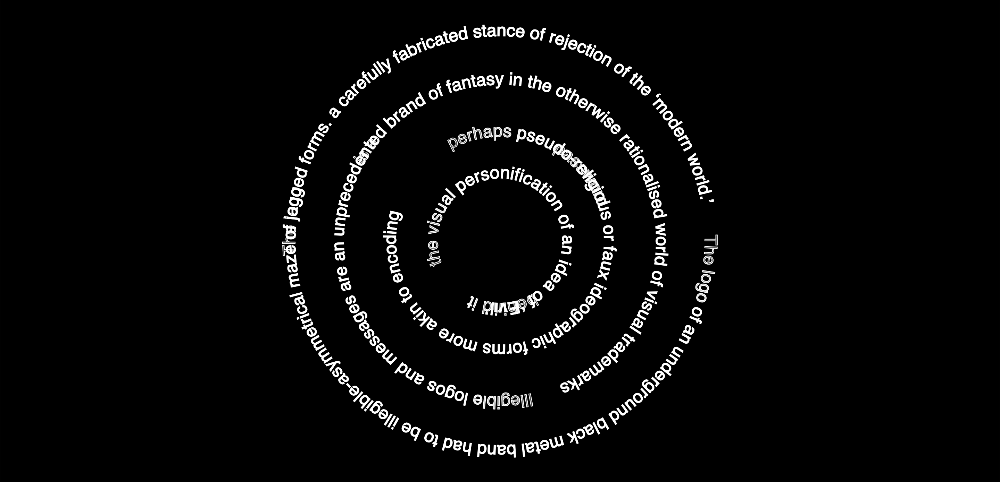
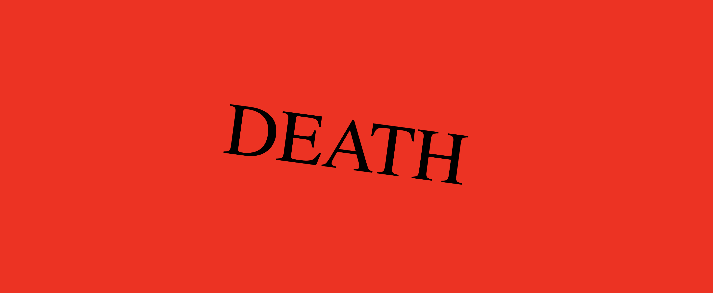
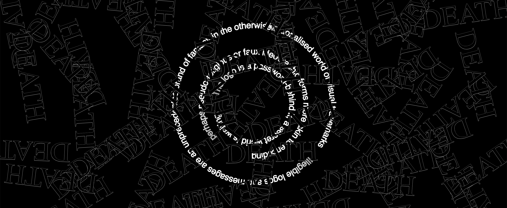

# this is what i did in week nine.
This week I began working on my code for the next assessment. 
I span the word death and also rotated some sentences which kinda looks maze-like which was what I was trying to achieve. Just tryna work out how to elevate it. I would like to try a typographic dla (diffusion limited aggregation). Not really sure how to do it, managed to do it with points and lines tho. 

