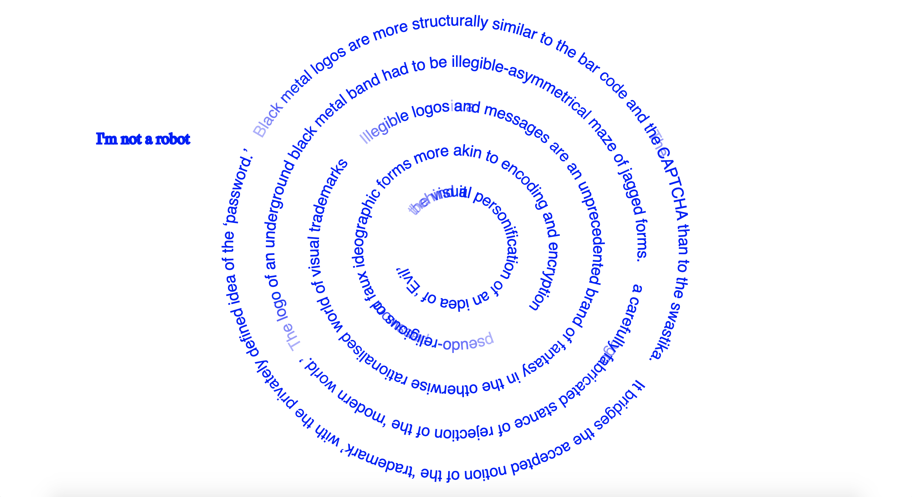
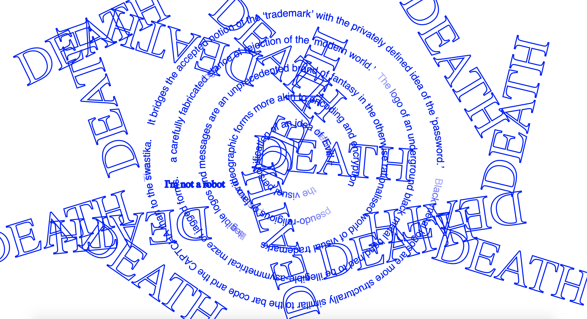
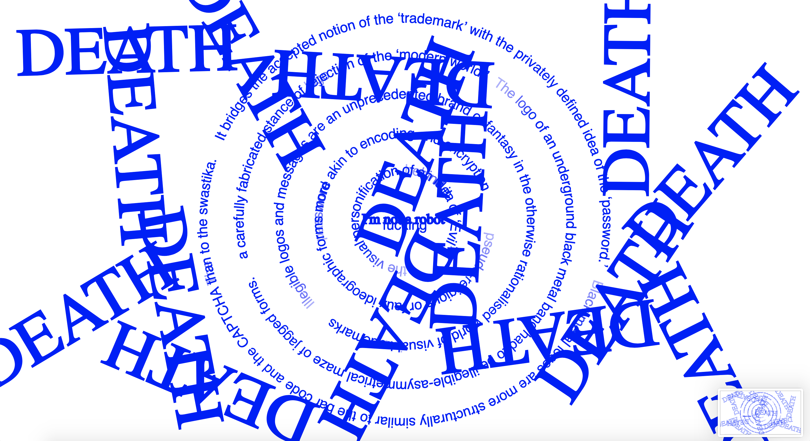

# this is what i did in week 10

This week I incorporated sound into my sketch among other small refinements and additions, but I'm lacking inspiration and confidence. I am aware the sketch is very far from completion but I am unsure of what the next step should be. I can't seem to figure out how to create this growing maze of words effect I desire. I resorted to looking online for resources again and while inspiring and cool, I found it's just no help for me as it generates more ideas in my head that I have no idea how to do. And the more I played a sketch and saw a blank screen the more discouraged and sad I got. So I've stopped looking at references and such online (AGAIN) and I am now dedicating the coming week to playing around and doing my own thing. 

[Click for updated spinning maze with SOUND](https://taylarogic.github.io/codeWords/10/spinningmaze)

[WEEK 09](https://taylarogic.github.io/codeWords/09/)~~~>[WEEK 11](https://taylarogic.github.io/codeWords/11/)
