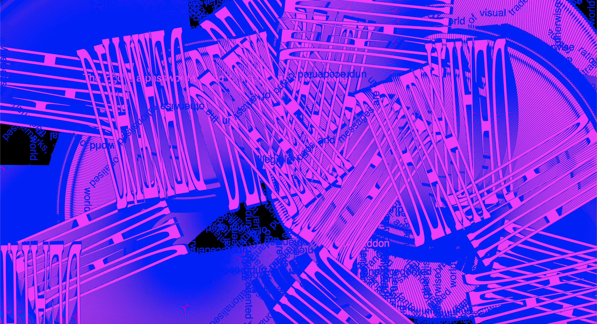
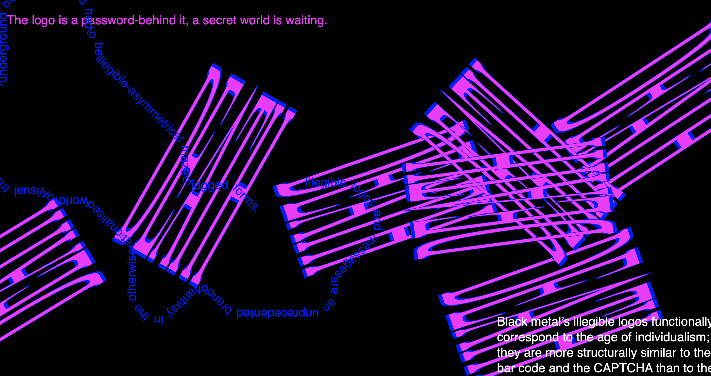
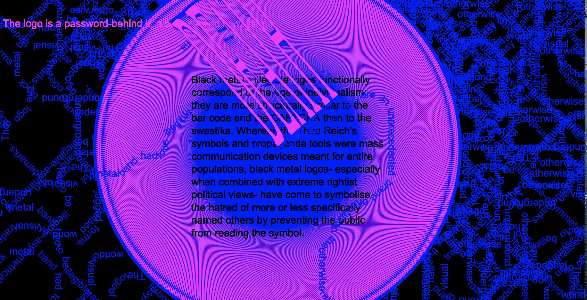

# this is what i did in week eleven. 

By spending this week playing rather than looking online at super advanced work and wondering 'how do I do that?,' I ended up achieving the idea I had from my prototype (jagged growing maze of words)!! Which I basically gave up on weeks ago because it was causing me to become manic and I was so stressed about it that I was even coding in my dreams- YES I was dreaming about my sketches (more like having nightmares). I am happy I adopted a new positive attitude, and returned to my design process of experimentation as happy accidents happened. 

I emailed Andy for advice as I was concerned about making dramatic changes to my code not long before it was due. Andy said 'The key to getting it right is to respect a process, reflect on the work at the different stages of this process, rather than thinking that you need to find the perfect “solution” to a problem within a given period of time.' 

I have accepted that my final work isn't something that I will have perfected or be 100% happy with, but it'll be something that I am able to feel very proud of. 

[WEEK 10](https://taylarogic.github.io/codeWords/10/)~~~>[WEEK 12](https://taylarogic.github.io/codeWords/12/)
