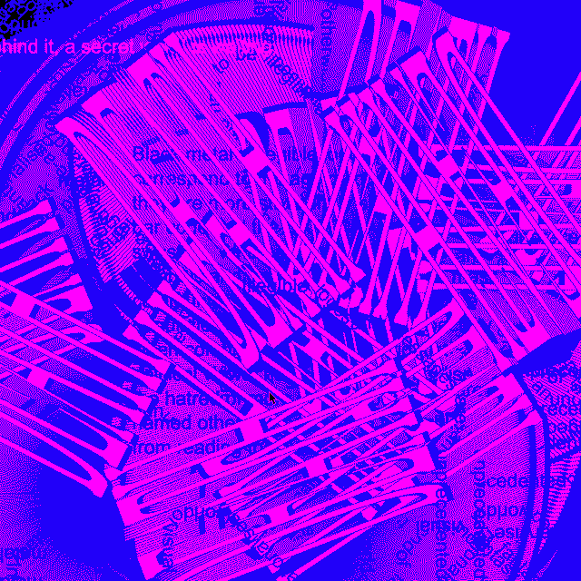

# this is what i did in week twelve.

In our final week we uploaded our final projects and got to see everyone's work which was so cool. I am so proud of my peers and what they achieved. I've found this studio to be so valuable and fun. It's definitely been my favourite. I'm so glad I took the chance to learn about code because it has become something that I really enjoy and want to expand my knowledge on. Last year I found myself in a stagnant position of not doing anything that was challenging me, and I hate feeling like I'm getting dumber (lol). This studio was the best decision I've made. It was challenging, exciting and rewarding. It has made me realise I want to learn more about this field of practice. I feel inspired again. Thanks Andy and Karen for that!
